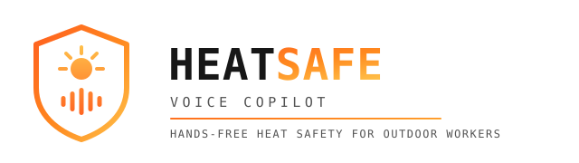

<div align="center">


<br>

<h2>SILVIA MOGAS</h2>

<h4>WEB3 BUILDER · TRUST INFRASTRUCTURE · PRODUCT & VENTURE OPERATOR</h4>


<br>

<p>
<strong>Silvia builds products, narratives, and trust layers across</strong><br>
digital identity, on-chain systems, and emerging technology.
</p>

<p>
Founder, Web3 builder, and product operator with 20+ years across marketing, partnerships,<br>
product, growth, and venture building — she turns ambitious ideas into working prototypes.
</p>

<br>

<a href="https://linkedin.com/in/silviamogas">
  
</a>
<a href="https://blockchainmarketingboutique.com">
  
</a>
<a href="https://trustthesignal.media">
  
</a>
<a href="mailto:hello@silviamogas.com?subject=Let%27s%20build%20together">
  
</a>

<br><br>


</div>

---

<br/>

## 🧭 About Silvia

**Founder · Web3 Builder · Product Operator · Hackathon Winner**

Silvia builds products and prototypes across **Web3, digital identity, trust infrastructure, consumer adoption, and real-world use cases**.

Her background is both strategic and product-driven. She brings more than 20 years of experience across **marketing, partnerships, product, growth, events, commercial strategy, and venture building**.

That gives her a practical perspective when she builds. She cares about the user, the market, the narrative, and the infrastructure behind the product.

In Web3, she focuses on one central question:

> **How to make trust programmable, usable, and understandable?**

She uses hackathons and technical sprints to test ideas quickly, validate real use cases, and move from concept to working product.

---

## 🛠️ What Silvia builds

```text
Current focus:
  ├── Digital identity
  ├── Attestations
  ├── Verifiable credentials
  ├── On-chain trust layers
  ├── Reputation systems
  ├── RWA and capital markets use cases
  ├── Consumer Web3 experiences
  ├── AI-assisted product workflows
  └── Venture studio prototypes
```

---

## 🧩 Ways to work with Silvia

| | | |
|---|---|---|
| **🪪 Digital Identity & Trust**<br>Verifiable credentials, attestations, and reputation systems that make trust programmable.<br>[`→ start a conversation`](mailto:hello@silviamogas.com?subject=Digital%20identity%20project) | **⛓️ Web3 Product Builds**<br>0→1 prototypes and MVPs shipped fast, with the right technical partners.<br>[`→ start a conversation`](mailto:hello@silviamogas.com?subject=Web3%20product%20build) | **🌍 RWA & Institutional Adoption**<br>Bridging real-world assets and capital markets with on-chain infrastructure.<br>[`→ start a conversation`](mailto:hello@silviamogas.com?subject=RWA%20project) |
| **🤝 Ecosystem & Venture Partnerships**<br>Go-to-market, narrative, and growth strategy for Web3 teams and venture studios.<br>[`→ start a conversation`](mailto:hello@silviamogas.com?subject=Partnership) | **🏆 Hackathon Collaboration**<br>A proven track record of shipping working prototypes under pressure, solo or as a team.<br>[`→ start a conversation`](mailto:hello@silviamogas.com?subject=Hackathon%20collaboration) | **🎤 Speaking & Advisory**<br>Talks and advisory on digital identity, trust infrastructure, and Web3 consumer adoption.<br>[`→ start a conversation`](mailto:hello@silviamogas.com?subject=Speaking%20or%20advisory) |

---

## 🏆 Hackathon Track Record

> Hackathons are where Silvia tests ideas, builds fast, collaborates, and turns abstract concepts into working prototypes.

| Year | Event                                           | Project / Focus               | Result                    |
| ---- | ----------------------------------------------- | ----------------------------- | ------------------------- |
| 2026 | **AI Hackathon · Dubai**                        | HeatSafe Voice Copilot        | 🎉 Finalist               |
| 2026 | **ETHGlobal Lisbon**                            | ColdProof                     | 🏆 Bounty Winner          |
| 2026 | **ETHGlobal NYC**                               | HeyLola Foundation Web3 layer | 🏆 Bounty Winner          |
| 2026 | **ETHGlobal Cannes**                            | Flow Broker                   | 🏆 2× Bounty Winner       |
| 2025 | **Coinbase Developer Platform Hackathon · NYC** | Web3 product prototype        | 🥉 3rd Prize              |
| 2025 | **Permissionless IV Hackathon**                 | Web3 infrastructure           | 💰 Prize Pool Winner      |
| 2025 | **Lovable Hackathon**                           | AI-assisted product build     | Participant               |
| 2024 | **ICP Hackathon · Bali**                        | Ticketing Passport            | Participant               |
| 2024 | **Polkadot Championship Hackathon**             | Digital Identity              | 🥉 3rd Place              |
| 2020 | **EU Global Hackathon**                         | COVID edition                 | Participant               |
| 2019 | **StartSud**                                    | Startup competition           | 🥇 Winner · Appointed CEO |
| 2019 | **Demium Startups**                             | Founder competition           | 🥇 Individual Winner      |

---

## 🎯 HeatSafe Voice Copilot · Dubai 2026

<div align="center">



</div>

<br/>

At an **AI hackathon in Dubai**, Silvia and her team built **HeatSafe Voice Copilot**, a hands-free AI voice assistant for construction and outdoor workers exposed to extreme heat.

The worker simply speaks to the agent while continuing the task, accessing live weather conditions, relevant safety information, and trusted guidance without having to stop, remove gloves, or search through a phone.

The team built the MVP using:

* **ElevenLabs** for voice
* **Context.dev (YC S26)** for live data and retrieval
* **Devin by Cognition** for build support

Where **ColdProof** connected physical-world data with digital infrastructure to protect the *product*, **HeatSafe** connects real-world conditions, live data, and AI directly with the *person* who needs that information, at the moment they need it.

<br/>

**Result:** 🎉 Finalist

---

## 🎯 ETHGlobal Lisbon 2026

At **ETHGlobal Lisbon 2026**, Silvia and her team built **ColdProof**, a cold-chain verification and reputation system connecting physical sensor data with on-chain infrastructure.

They developed a working hardware prototype that captured temperature data and transformed it into verifiable shipment records.

The project explored how blockchain infrastructure could improve transparency, accountability, and trust across temperature-sensitive supply chains.

The team used:

* **Hedera** to register and verify cold-chain events
* **ENS** to create portable identities for transporters
* **The Graph** to index and query compatible on-chain data
* **Physical temperature sensors** to capture real-world information
* **A reputation scoring engine** to calculate the ColdProof Score

The **ColdProof Score** converts shipment conditions, temperature incidents, data continuity, and historical performance into an accessible reputation indicator.

The prototype connected physical infrastructure with on-chain verification and transporter reputation.

<br/>

**Result:** 🏆 Bounty Winner

---

## 🎯 ETHGlobal NYC 2026

At **ETHGlobal NYC 2026**, Silvia built a new Web3 layer for **HeyLola Foundation** as a solo hacker.

The project focused on making crypto donations more accessible, transparent, and emotionally connected.

She explored how blockchain tools could help people sponsor shelter dogs, increase adoption visibility, and create more trusted donation flows.

For this MVP, she used:

* **Chainlink**
* **Privy**
* **Blink Cash**

The prototype connected social impact with crypto-native donation and sponsorship flows.

<br/>

**Result:** 🏆 Bounty Winner

---

## 🎯 ETHGlobal Cannes 2026

At **ETHGlobal Cannes 2026**, Silvia and her team built **Flow Broker**, an on-chain workflow automation and execution prototype.

They explored how decentralized infrastructure and programmable workflows could make complex financial operations more coordinated, accessible, and efficient.

The project combined automation, blockchain infrastructure, and on-chain execution tools to create smarter transaction flows.

<br/>

The team won two bounties:

* **Best Uniswap API Integration**
* **Best Workflow with Chainlink CRE**

<br/>

**Result:** 🏆 2× Bounty Winner

---

## 🎖️ Recognition & Nominations

> Visibility matters. When the work of women in this industry is not visible, it can feel smaller than it actually is, even when the impact, experience, and results are very much there.

| Date            | Recognition                                                                | Context                             |
| --------------- | -------------------------------------------------------------------------- | ----------------------------------- |
| **August 2026** | **Women of Web3 · Nominee** — Science Summit at the United Nations (UNGA81) | Second consecutive nomination       |
| **August 2025** | **Women of Web3 · Nominee** — Science Summit at the United Nations (UNGA80) | First nomination                    |
| **2023**         | **Becas Closing The Gap · Awardee** — 6ª edición                          | Scholarship recipient               |

<br/>

Being nominated for the **Women of Web3** session at the **United Nations Science Summit** for a second consecutive year is an honour for Silvia, placing her name alongside many women who are building, leading, and contributing to the evolution of Web3 and emerging technologies.

There is no shortage of talented women in technology. They are building companies, leading teams, investing, researching, creating communities, speaking on stages, and shaping some of the most important conversations in the industry. What is often missing is not talent, but amplification.

That is why initiatives like this matter. Visibility brings opportunities, creates new connections, and makes it easier for other women to see that there is also a place for them in these rooms.

Silvia is grateful to **Women of Web3**, the **Science Summit at the United Nations**, and everyone involved in making these spaces possible.

`#WomenOfWeb3` · `#Web3` · `#EmergingTech` · `#WomenInTech` · `#ScienceSummit` · `#UNGA`

---

## 🔐 Areas Silvia is exploring

```text
Research and build interests:
  ├── DID / decentralized identity
  ├── Verifiable credentials
  ├── Attestations
  ├── Reputation systems
  ├── Web3 consumer onboarding
  ├── Wallet-based user journeys
  ├── Crypto donation flows
  ├── RWA and institutional adoption
  ├── AI x Web3 workflows
  └── Trust as product infrastructure
```


</div>

---

## 🤝 Let’s build

Silvia is open to:

* Hackathon collaborations
* Web3 product experiments
* Digital identity projects
* Reputation and trust infrastructure
* RWA and capital markets infrastructure
* Ecosystem partnerships
* Social-impact Web3 use cases
* Bounties and venture conversations

<br/>

---

<div align="center">


<br><br>


<br>

<a href="mailto:hello@silviamogas.com?subject=Let%27s%20build%20together">
  
</a>

<br><br>

<a href="https://linkedin.com/in/silviamogas">
  
</a>
<a href="https://blockchainmarketingboutique.com">
  
</a>
<a href="https://trustthesignal.media">
  
</a>
<a href="mailto:hello@silviamogas.com">
  
</a>


<br><br>


</div>
